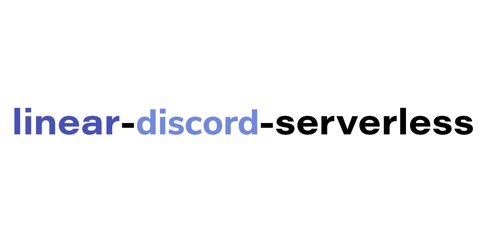

<h3 align="center">Get linear's events forwarded to Discord webhooks through Vercel serverless functions.</h3>

### Installation

Please visit [lds.alistair.cloud](https://lds.alistair.cloud) which documents the setup. In short, we form a URL that contains the Discord webhook ID and Token, and use that as our linear URL. That way we can use the body with ID and Token in a stateless environment.

### Video Guide

I've made a small video guide to visually demonstrate setup. You can watch it on [YouTube](https://youtu.be/QgDt8yUnQcA).

### Credits

This project is heavily inspired by [@ezolla](https://github.com/ezolla)'s amazing [linear-app-discord](https://github.com/ezolla/linear-app-discord). If you're looking for more control over the data sent, I recommend checking that out.
